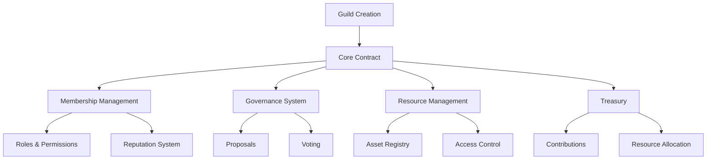

# Federated Crosschain Toolkit

A comprehensive decentralized toolkit for cross-chain federation, enabling secure and flexible multi-chain coordination. The Federated Crosschain Toolkit provides robust infrastructure for creating interconnected, autonomous organizations that can seamlessly operate across different blockchain networks.

## Overview

The Federated Crosschain Toolkit offers a comprehensive framework for cross-chain governance and collaboration with features including:

- Guild creation and membership management
- Hierarchical role-based permissions system
- Democratic governance through proposal voting
- Resource and asset management
- Reputation and contribution tracking
- Treasury management
- Customizable governance rules

## Architecture

The platform is built around a core smart contract that manages all guild-related functionality:



### Core Components:

1. **Guild Management**
   - Guild creation with staking requirement
   - Member invitation and management
   - Role-based access control

2. **Governance System**
   - Proposal creation and voting
   - Weighted voting based on member tier and reputation
   - Configurable voting thresholds

3. **Resource Management**
   - Asset registration and tracking
   - Permission-based resource access
   - Treasury management

## Getting Started

### Prerequisites

- Clarity CLI
- Stacks wallet
- Required stake amount for guild creation (1,000,000 microstacks)

### Basic Usage

1. **Create a Guild**
```clarity
(contract-call? .crosschain-federation create-federation 
    "Crosschain Alliance" 
    "Multi-network collaborative organization" 
    u1000000)
```

2. **Join a Guild**
```clarity
(contract-call? .byteguild-core join-guild 
    guild-id)
```

3. **Create a Proposal**
```clarity
(contract-call? .byteguild-core create-proposal
    guild-id
    "Proposal Title"
    "Proposal Description"
    u144
    "ACTION"
    none)
```

## Function Reference

### Guild Management

- `create-guild`: Create a new guild
- `invite-member`: Invite a user to join a guild
- `join-guild`: Join an existing guild
- `leave-guild`: Leave a guild
- `transfer-ownership`: Transfer guild ownership to another member

### Governance

- `create-proposal`: Create a new governance proposal
- `vote-on-proposal`: Cast a vote on an active proposal
- `finalize-proposal`: Conclude voting and execute proposal results

### Resource Management

- `contribute-to-treasury`: Make a contribution to guild treasury
- `add-guild-asset`: Register a new guild asset
- `set-resource-permissions`: Configure access permissions for resources

### Member Management

- `set-member-role`: Modify a member's role
- `award-reputation`: Grant reputation points to members

## Security Considerations

### Access Control
- Hierarchical role system (Owner → Admin → Member → Guest)
- Function-level permission checks
- Resource access control through permission mapping

### Asset Safety
- Treasury management with proper accounting
- Asset transfer restrictions
- Protected administrative functions

### Governance Security
- Minimum voting duration enforcement
- Weighted voting system
- Vote manipulation prevention

## Development

### Local Testing

1. Deploy contract:
```bash
clarinet deploy
```

2. Run test suite:
```bash
clarinet test
```

### Key Constants

```clarity
REQUIRED-STAKE-AMOUNT: u1000000
MIN-VOTE-DURATION: u144 (approximately 1 day)
DEFAULT-VOTING-THRESHOLD: u51 (51% majority)
```

### Roles

```clarity
ROLE-OWNER: u100
ROLE-ADMIN: u50
ROLE-MEMBER: u10
ROLE-GUEST: u1
```